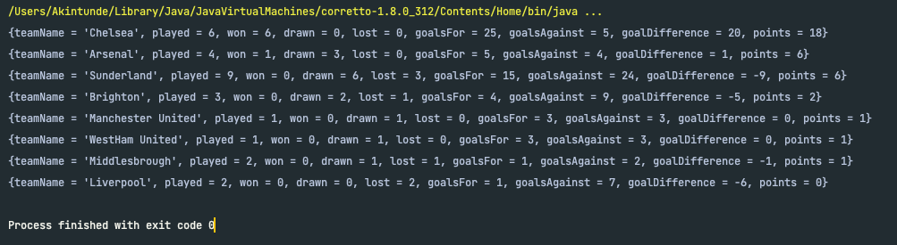
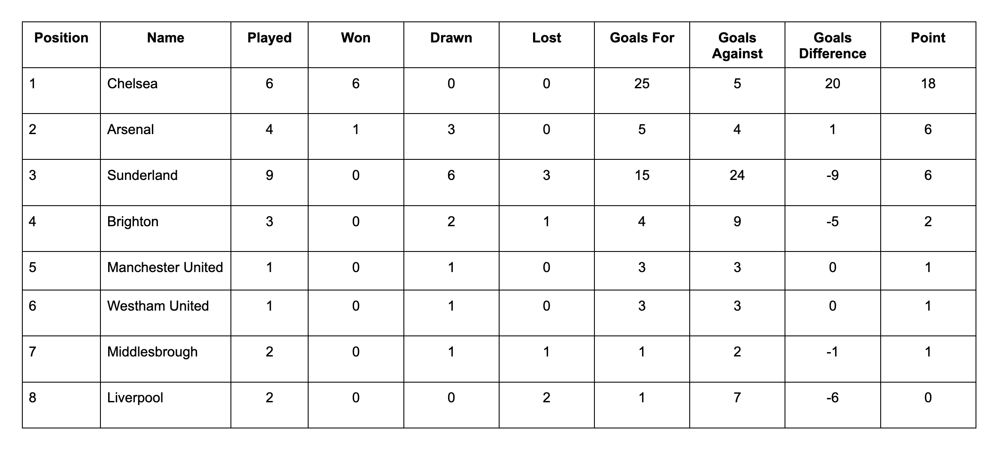

## Dynamic Football League Table Generator
This application implements a league table generator for football game. It allows for extensibility to other games like cricket, baseball, etc.
In such cases, a new class that allows for sport-specific behaviour customization (e.g. CricketLeagueTable) is created and it extends **LeagueTable** abstract class.

### How to run the application
* Clone this repository
* Ensure the local machine has JDK 8 (or above) installed
* Build this project using an IDE of choice (IntelliJ IDEA is recommended)
* Run the **main** function inside **FootballLeagueTableGeneratorRunner.java** file using the PLAY button provided by the IDE

### Assumptions and decisions made in this solution
* The league table generator generates an output based on the matches played so far (i.e. based on the input supplied to it). 
* An instance of **FootballLeagueTable** does not allow match list update after class object instantiation.

### Point to note
* I interpreted "Future reuse and extension of code" (as stated in the question README.md file) as "the solution code being easily re-used for other 
sports other than football and extensible for different variants of sport (e.g. street football is a variant of 
football which might have different table entry computation and sorting rules)". This interpretation informed my decision
to make **LeagueTable** class abstract. I am aware that **LeagueTable** class cannot be instantiated as the JUnit test suite might have expected. However, **FootballLeagueTable** class is to be instantiated instead.
**LeagueTable** and **FootballLeagueTable** have the same constructor signature.

### Possible improvement
* Allow match list to be updated by exposing an **updateMatchList(List)** API in the **LeagueTable** class.

### Appendix

#### Output of FootballLeagueTableGeneratorRunner#main:

#### Manual Computation of data inside FootballLeagueTableGeneratorRunner
